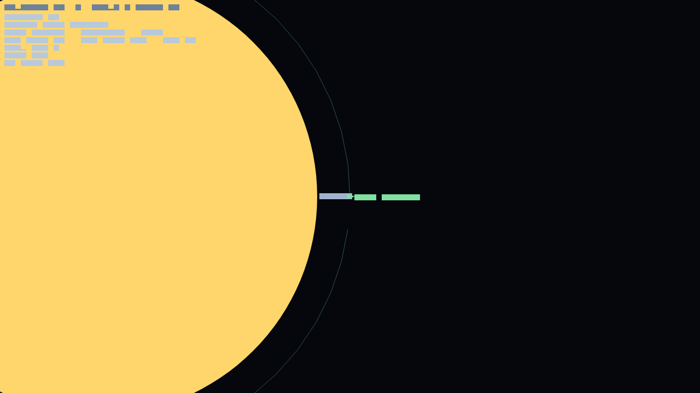

# Tutorial — Your First Flight (v0.1.0)

A 10-minute guided tour. Assumes you've launched the app (`flutter run -d
windows`). The demo starts with three craft already in the world: a **Demo
Orbiter** (your focus), a **Surface Miner**, and an **Auto Freighter**.



---

## Step 1 — Read the HUD

Top-left, find your focus vessel's line:

```
VESSEL Demo Orbiter
body kerbin   ON-RAILS   LINK
alt 120.0 km   vel 2280 m/s   thr 0%
fuel 400   dv 1850 m/s
```

- **ON-RAILS** — you're coasting; the orbit is analytic.
- **LINK** — you have a comms signal (autopilot can act).
- **dv** — remaining delta-v budget. Spend it wisely.

Watch the faint ring around your vessel — that's your **predicted orbit**.

## Step 2 — Zoom & look around

Press `]` a few times to zoom in on your ship, `[` to zoom out and see the whole
orbit. Pinch/scroll works too. Notice the bright central body (Kerbin) and its
atmosphere glow.

## Step 3 — Take manual control

Press **`M`**. The bottom-left bar turns orange: **MANUAL**. Your vessel's
autopilot is now disabled.

- Hold **`Shift`** — throttle to 100% (watch `thr` climb, fuel drop).
- Tap **`W` / `S`** — pitch the nose; the triangle rotates.
- Tap **`A` / `D`** / **`Q` / `E`** — yaw / roll.

Burn **prograde** (along your velocity) to raise your orbit; watch the predicted
ring swell. Burn **retrograde** to lower it. Press **`M`** again to hand back to
the autopilot.

## Step 4 — Watch the autopilot fly a transfer

The **Auto Freighter** has a pre-loaded Hohmann transfer plan. Let time run
(it's at 50× warp by default). When its first maneuver node comes due, the
autopilot:
1. checks it has enough Δv (aborts if not),
2. points the ship prograde,
3. fires the gimballed engine,
4. coasts to apoapsis and circularizes.

Its orbit ring will grow as it climbs. If it ever loses **LINK** (passes behind
the planet with no relay), it pauses until contact returns.

## Step 5 — Mining & ISRU

The **Surface Miner** is landed on an ore deposit, drill active. Over time its
ore tank fills (HUD shows `ore`). A colony-ship variant could run **ISRU** —
converting that ore into fuel/oxygen on the spot — so you never need to haul
propellant from home.

## Step 6 — The colony

A colony, **New Kerbal City**, runs on the surface. Its HUD line shows
population, power, and water. It has a refinery (ore → water), housing, and a
solar plant. As cargo flights arrive they create **RCI demand**, and zoned cells
grow new buildings — provided they're road-connected and the city is happy.

## Step 7 — Save & resume

Hit **💾**. Let the sim run a while, then **📂** to restore — everything snaps
back exactly: positions, fuel, plans, crew. (Saves are in-memory this release.)

---

## Going further

- Plan your own transfer: the `ManeuverPlanner` produces Hohmann / plane-change
  nodes; hand them to a vessel's flight plan and the autopilot flies them.
- Try the **real Solar System** (`RealSolarSystem.build()`) — fly from Low Earth
  Orbit to the Moon, or aerobrake at Mars (CO₂ heats more — bring a heat shield).
- Crew a ship and cross a radiation belt without shielding. Don't.

See **USER_GUIDE.md** for the full system reference.
