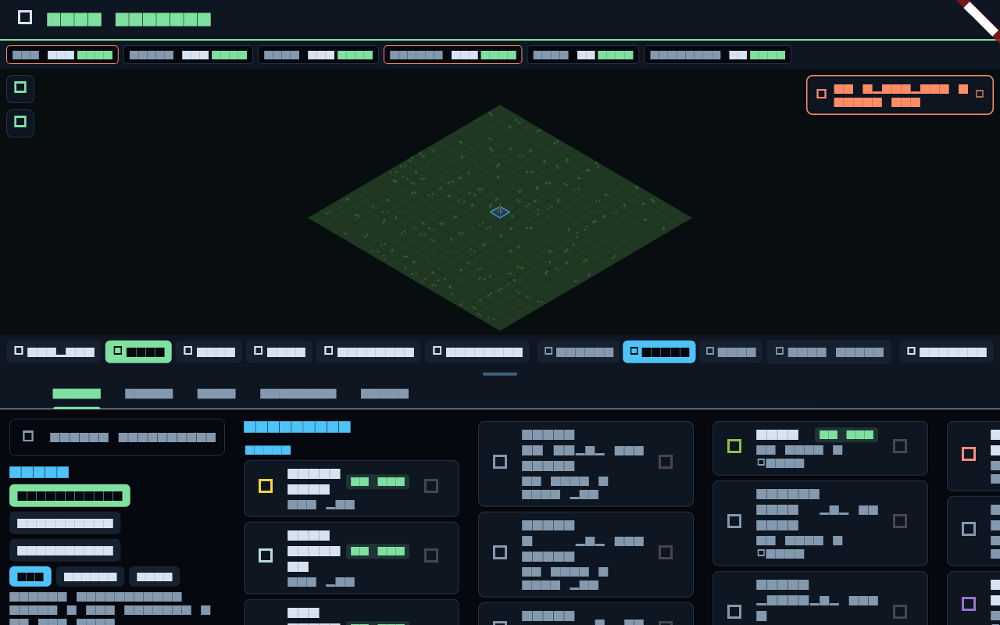

# Colonies & Economy

Spaceflight is the means; building a presence is the end. Beyond flying rockets,
ACRO lets you land, extract resources, and grow a colony with a working economy.

## From a landing to a settlement

Once a craft is down on a body's surface you can establish a **colony** there. A
colony is a collection of **buildings** on a tile map, each with a job, that together
consume and produce **resources** and support a **population**.

## Buildings and their states

Each building has a clear operational state shown in its details — and a matching
icon when something is wrong, so you can see problems at a glance:

- **Operating / connected** — running normally.
- **Understaffed** — not enough population assigned to run it.
- **Unpowered** — no power supply reaching it.
- **Abandoned** — no longer in use.
- **Unprocessed corpses / unhappy** — colonist-welfare problems that drag the colony
  down.

A building's details always reflect its *actual* state, not just "operating" — an
understaffed or unpowered building says so.

## Resources

Colonies run on resource flows: **power**, **ore** and refined materials, **food**,
**water**, plus waste streams like **garbage**, **sewage**, and **air pollution**.
Buildings produce and consume these; a shortfall (no power, no food) cascades into the
building states above. Keep the flows balanced.

- A **spaceport** is your link to orbit. Crucially it does **not** magic resources
  into being — ore and goods arrive only by **delivery**, and population grows only
  when you **request** colonists through the spaceport (growth is demand-driven, not
  automatic).
- **Deliveries** can be one-time (the default) or recurring (a checkbox), and can
  carry **people** as well as goods.

## Population

Colonists staff buildings and consume food, water, and living space. Population only
**grows when you request it** via the spaceport — so a colony scales at the rate you
choose to supply it, not on its own. Welfare problems (pollution, unhappiness,
unprocessed dead) suppress growth and productivity.

## Mining & ISRU

Resources start in the ground. **Mining** buildings and craft extract ore from
**deposits** on a body; **ISRU** (In-Situ Resource Utilisation) converts raw
material into usable propellant and goods. This is what makes a colony self-sufficient
— and what lets you refuel a vehicle far from home instead of hauling everything up
Earth's gravity well.

## Hazards

A living colony faces **disasters** (rare — on the order of one significant event
every several minutes, not constant) and environmental pressure: too many high-density
residential blocks, for instance, drive **air pollution** up. Balancing growth against
pollution, power, and welfare is the core of the colony game, the same way balancing
Δv against mass is the core of the flight game.

## The loop

Fly → land → mine → build → grow → launch again, now from a forward base with its own
fuel and supplies. The economy and the flight model are the two halves of ACRO: one
gets you there, the other lets you stay.
