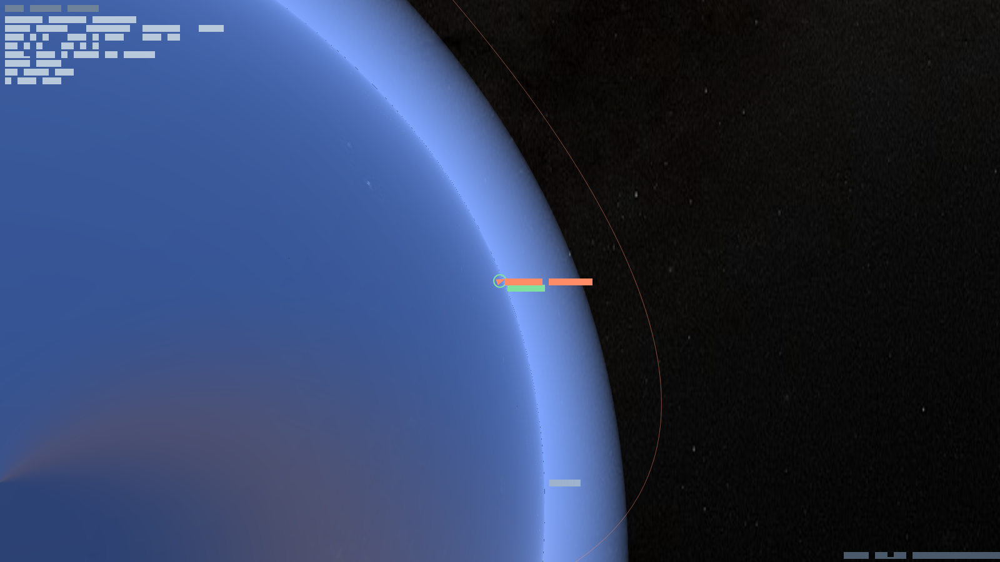

# ACRO Space Simulator

**A full-scale, physics-true space-flight sandbox.** Build a rocket, fly it off the
launch pad, ride real orbital mechanics into space, slingshot between worlds, land
on another planet, and grow a colony — all on a 1 : 1 scale model of the real Solar
System, rendered from the ground to interplanetary distance without a seam.

ACRO is **not** an arcade space game. Every flight is governed by Newtonian gravity,
Keplerian orbits, atmospheric drag, aerodynamic heating, staging, and mass flow —
the same systems a real mission planner reasons about, made playable. If you have
flown Kerbal Space Program you will feel at home; if you have not, the
[Quickstart](Quickstart.md) and [Tutorial](Tutorial.md) take you from the menu to a
stable orbit step by step.

---

## What makes it different

- **One scale, no fakery.** Earth is 6 371 km. Low orbit is 1 000 km up. The Moon is
  384 000 km away. The renderer holds all of it — you can zoom continuously from a
  craft on the runway out past the Moon and back, the planet a true 3-D sphere the
  whole way with a soft atmosphere on its limb. See [Rendering & Camera](Rendering.md).
- **Real orbital mechanics.** Orbits are real conic sections. Coast on rails as an
  analytic Kepler ellipse; light the engine and the integrator switches to full
  Runge–Kutta force integration. Plan burns, watch your apoapsis and periapsis move,
  and transfer between bodies. See [Orbital Mechanics](Orbits.md).
- **Atmosphere that bites.** Drag rises transonically, dynamic pressure (max-Q) can
  tear a craft apart, and reentry heats your hull toward its limit. See
  [Atmosphere, Drag & Reentry](Atmosphere.md) and [Thermal & Heating](Thermal.md).
- **Build, stage, burn.** Assemble multi-stage vehicles, manage propellant and mass,
  throttle and gimbal, and decouple spent stages. See
  [Vehicles, Staging & Propulsion](Propulsion.md).
- **Beyond the rocket.** Land, mine resources, and run a colony economy. See
  [Colonies & Economy](Colonies.md).

---

## Start here

| If you want to… | Read |
|---|---|
| Understand what the game is and install it | this page → [Quickstart](Quickstart.md) |
| Fly your first rocket to orbit | [Tutorial: From Pad to Orbit](Tutorial.md) |
| Learn the flight controls and HUD | [Quickstart](Quickstart.md) |
| Understand the physics under the hood | the **Mechanics** pages below |
| Read the code-level API | the generated dartdoc in `doc/api/` |

### Mechanics reference
- [Flight Model & Physics Core](Physics.md) — the simulation loop, forces, integration
- [Orbital Mechanics](Orbits.md) — elements, rails vs. physics, transfers, SOI changes
- [Atmosphere, Drag & Reentry](Atmosphere.md) — density, Mach, dynamic pressure, max-Q
- [Thermal & Heating](Thermal.md) — heat capacity, reentry flux, overheating
- [Vehicles, Staging & Propulsion](Propulsion.md) — engines, Isp, the rocket equation
- [Colonies & Economy](Colonies.md) — cities, mining, resources
- [Rendering & Camera](Rendering.md) — the perspective camera and the planet renderer

---

*ACRO Space Simulator is built in Flutter/Dart with a strict Domain-Driven /
Clean-Architecture core: the physics is pure Dart with zero engine dependencies, so
the same simulation runs on web, desktop, and mobile. Body surface maps courtesy of
[Solar System Scope](https://www.solarsystemscope.com/) (CC BY 4.0); star map from
NASA Deep Star Maps 2020 (public domain).*
