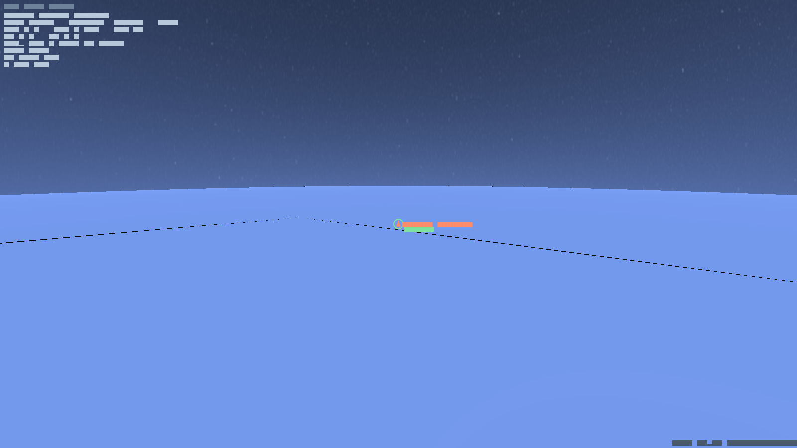

# Orbital Mechanics

Orbits are the heart of ACRO. This page explains what an orbit *is* in the game, the
six numbers that define it, how the sim switches between an exact analytic orbit and
full physics, and how you travel between worlds.

## An orbit is a conic section

Under a single body's gravity a coasting vessel follows a **conic section** — a closed
**ellipse** (a bound orbit), or an open **parabola/hyperbola** (an escape trajectory).
A circle is just an ellipse with both ends at the same height. The two ends of an
elliptical orbit are:

- **Apoapsis (AP)** — the highest point, where you move slowest.
- **Periapsis (PE)** — the lowest point, where you move fastest.

If your periapsis is *below the surface* (or inside the atmosphere), your "orbit"
intersects the planet — you are on a suborbital arc and will come back down. Getting
to orbit means **raising your periapsis out of the atmosphere**, which is exactly what
the circularisation burn in the [Tutorial](Tutorial.md) does.

## The six orbital elements

Any orbit is fully described by six numbers (the *Keplerian elements*):

| Element | What it sets |
|---|---|
| **Semi-major axis** (a) | the orbit's overall size (and so its period) |
| **Eccentricity** (e) | how stretched it is — 0 is a circle, →1 is very elongated |
| **Inclination** (i) | the tilt of the orbital plane vs. the body's equator |
| **Longitude of ascending node** (Ω) | where the plane crosses the equator going up |
| **Argument of periapsis** (ω) | where in the plane the low point sits |
| **True anomaly** (ν) | where *you* are along the orbit right now |

ACRO converts freely between this **element** form and the **state-vector** form
(position + velocity). Coasting flight is propagated in element form; the moment you
burn, it converts to a state vector, integrates the thrust, and converts back.

## Rails vs. physics

- **On-rails:** when you are coasting with the engine off and out of the atmosphere,
  the orbit is a *fixed* ellipse. Your position at any future time is solved directly
  (Kepler's equation), so there is **no integration drift** — you can time-warp across
  days and arrive exactly where the math says.
- **Physics:** the instant a force perturbs you — thrust, drag — the sim switches to
  numerical integration. Cut the engine in vacuum and it snaps back to a clean
  analytic ellipse.

This is why a burn *moves* your AP/PE markers in real time, and why coasting is free
to fast-forward.

## Changing your orbit (intuition)

A few rules of thumb that make maneuvering click:

- **Burn prograde** (along your velocity) → raises the *opposite* side of the orbit.
  Burn at periapsis to raise apoapsis; burn at apoapsis to raise periapsis.
- **Burn retrograde** (against velocity) → lowers the opposite side. This is how you
  **deorbit**: burn retrograde to drop your periapsis into the atmosphere.
- **Burn normal / anti-normal** (perpendicular to the plane) → changes inclination.
- **Small burns at the right place beat big burns at the wrong place.** Maneuvering is
  about *timing*, not brute force.

## Transfers and spheres of influence

To travel to another world you raise your orbit until it crosses the target's path at
the right time (a **Hohmann-style transfer** is the cheapest two-burn version). As you
approach another body you cross its **sphere of influence (SOI)** — the region where
that body's gravity dominates. At the SOI boundary the sim **hands you off** to the new
body: your trajectory is re-expressed relative to it, and what was an escape hyperbola
from Earth becomes a capture (or flyby) at the Moon. Plan the encounter so your
periapsis at the target is where you want it, then burn to capture.

## Δv — the currency of space

Every maneuver costs **Δv** (change in velocity), and your vehicle has a finite Δv
budget set by its engines and propellant (the rocket equation —
[Vehicles, Staging & Propulsion](Propulsion.md)). Mission planning is Δv budgeting:
reach low Earth orbit (~9–9.5 km/s including losses), transfer to the Moon (~3–4 km/s
more), land, return… Watch the `dv` field on the HUD — when it hits zero, you coast.
