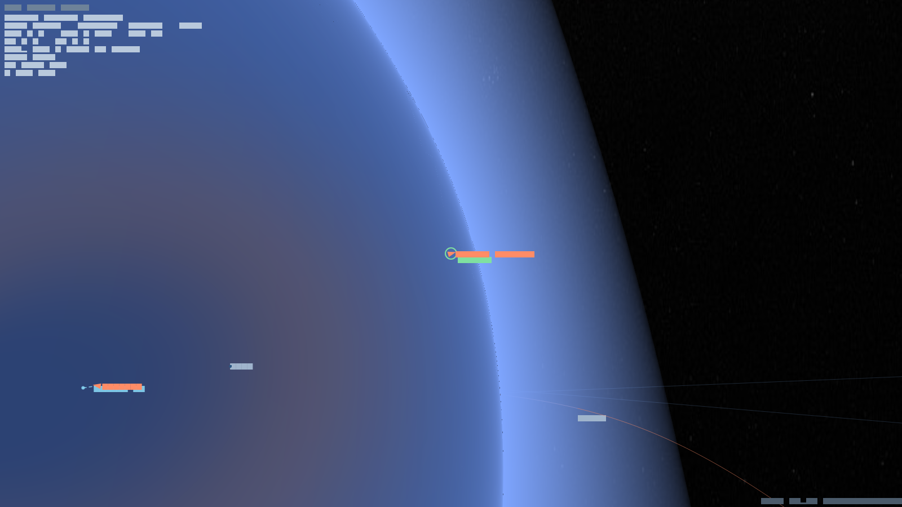
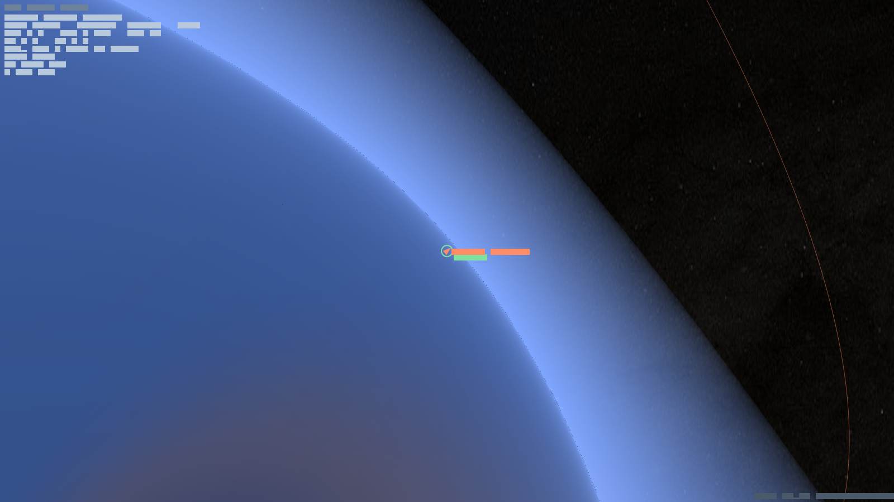

# ACRO Space Simulator — Fly the real Solar System, 1 : 1

> **Build it. Launch it. Make orbit. Go further.**
> A physics-true space-flight sandbox where every kilometre is real, from the launch
> pad to the far side of the Moon — no loading screens, no fake scale, no seams.

---

## See it

| | |
|---|---|
|  | **A real atmosphere.** A per-pixel scattering shader glows on the limb from orbit and hazes your horizon on the ground — correct at every altitude. |
|  | **Stand on another world.** Zoom continuously from interplanetary space down to a craft on the surface, the planet a true 3-D sphere the whole way. |
|  | **One scale, no fakery.** Earth is 6 371 km. Orbit is 1 000 km up. The Moon is 384 000 km away. The engine holds all of it at once. |

---

## What you do

- **Build** a multi-stage rocket in the assembly building — engines, tanks, staging.
- **Launch** it: fly the gravity turn, ride max-Q, stage away spent boosters.
- **Make orbit** under real Keplerian mechanics — watch your apoapsis and periapsis
  move as you burn.
- **Travel** between worlds on real transfer orbits and sphere-of-influence handoffs.
- **Survive** reentry heating and dynamic-pressure loads on the way down.
- **Land, mine, and build** a self-sufficient colony with a working resource economy.

## Why it's different

Every flight obeys Newtonian gravity, conic orbits, atmospheric drag and heating,
staging, and the rocket equation — the same systems a real mission planner uses, made
playable. It is built on a strict Domain-Driven / Clean-Architecture core in
Flutter/Dart: the physics is pure Dart with zero engine dependencies, so the same
simulation runs on web, desktop, and mobile.

---

## Get started

- **[Quickstart](Quickstart.md)** — install, controls, your first flight.
- **[Tutorial: From Pad to Orbit](Tutorial.md)** — a guided climb to a stable orbit.
- **[The full guide](Home.md)** — every mechanic, including the physics, explained.

*Body maps © [Solar System Scope](https://www.solarsystemscope.com/) (CC BY 4.0);
star map from NASA Deep Star Maps 2020 (public domain).*
