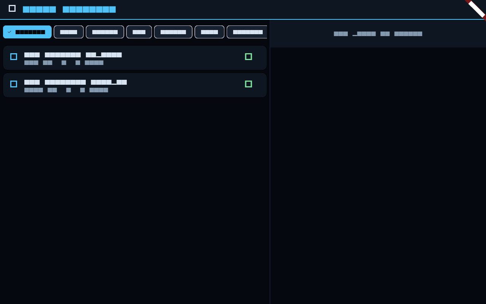

# Vehicles, Staging & Propulsion

Your rocket is the tool that buys you Δv. This page covers how engines produce
thrust, why staging exists, and the one equation that governs how far you can go.



## Engines: thrust and the exhaust

A rocket engine throws mass (exhaust) out the back fast; the reaction pushes the
ship forward. Two numbers describe an engine:

- **Thrust** (newtons) — the push. More thrust = more acceleration for a given mass.
- **Specific impulse, Isp** (seconds) — the *efficiency*. It's the exhaust velocity
  expressed in seconds: `v_e = Isp · g₀` (g₀ = 9.81 m/s²). Higher Isp means more push
  per kilogram of propellant burned.

Propellant **mass flow** follows directly: `ṁ = thrust / v_e`. So at full throttle a
high-thrust engine drains its tanks fast, and a high-Isp engine makes the same
propellant last longer.

### Sea level vs. vacuum

An engine's thrust and Isp depend on ambient pressure. Atmospheric back-pressure on
the nozzle robs some thrust low down, so each engine has a **sea-level** and a
**vacuum** rating; the sim interpolates by the local air pressure. A vacuum-optimised
engine is weak at sea level; a sea-level engine wastes performance in space. Real
rockets stage partly to switch nozzles.

### Throttle and gimbal

- **Throttle** scales thrust (and propellant flow) from 0–100 %. The fine throttle
  (0–10 %) is for delicate landing burns.
- **Gimbal** lets the engine vector its thrust a few degrees to steer — off-axis
  thrust produces a torque that rotates the craft. A fixed nozzle can't steer.

## Mass, and why it dominates everything

A vehicle's acceleration is `a = F/m`. As propellant burns, `m` drops, so the *same*
thrust accelerates you harder and harder — a rocket is lightest (and twitchiest) just
before a stage runs dry. This changing mass is the heart of the rocket equation.

## Staging

Carrying empty tanks and spent engines is dead weight. **Staging** drops them:

- A **stage** is a group of parts (engine + tanks) that fire together.
- When a stage is spent, **decouple** it (the STAGE button) to shed its dry mass.
- The next stage ignites, now pushing a much lighter vehicle.

This is why orbital rockets are tall stacks: each stage hauls the next a bit higher
and faster, then falls away. A single-stage vehicle has to carry all its structure
the whole way — usually impossible to reach orbit from Earth.

## The rocket equation (the one that matters)

Tsiolkovsky's rocket equation gives a stage's Δv:

```
Δv = v_e · ln(m_wet / m_dry) = Isp · g₀ · ln(m_start / m_end)
```

where `m_wet` is the fully-fuelled mass and `m_dry` the mass after the propellant is
gone. Read it carefully — Δv depends on:

1. **Isp** (engine efficiency), and
2. the **mass ratio** `m_wet/m_dry`, through a **logarithm**.

The log is the cruel part: doubling your propellant does **not** double your Δv. To
get more Δv you need exponentially more fuel, or a better engine, or to stage away
dry mass. This is why spaceflight is hard and why every kilogram counts.

## Putting it together: a launch budget

Reaching low Earth orbit costs ~9–9.5 km/s of Δv (7.7 km/s orbital speed + gravity
and drag losses). To build a vehicle that can do it:

- Pick engines with enough **thrust** to lift off (thrust-to-weight > 1) and good Isp.
- Stack enough **propellant** for ~9.5 km/s via the rocket equation — usually 2+
  stages.
- Check the **Δv readout** in the HUD; it's the rocket equation evaluated live as you
  burn.

From orbit, every further destination is another Δv line item — see
[Orbital Mechanics](Orbits.md).
