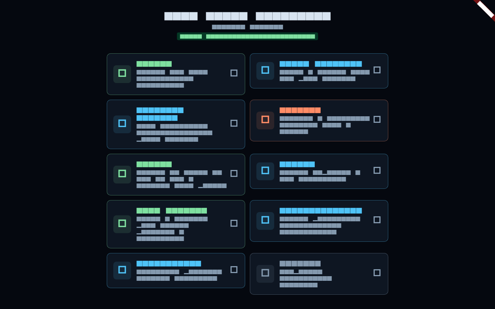

# Quickstart

This page gets you from a fresh launch of ACRO to flying a craft, and explains the
on-screen flight controls. New to the genre? Do this first, then follow the
[Tutorial](Tutorial.md) for a guided climb to orbit.

## Installing & running

ACRO is a Flutter app and runs as a web build or a native desktop/mobile build.

```bash
# from the repository root
flutter pub get
flutter run -d chrome            # run in the browser
# or build a static web bundle:
flutter build web --pwa-strategy=none
```

The build drops a static site in `build/web/` you can serve with any web server.

## The main menu



The menu is a grid of feature tiles — flight, the vehicle assembly building (VAB),
the city/colony builder, mining, maneuver planning, megastructures, multiplayer, and
options. Pick **Flight** to drop into the simulator with a craft ready to fly.

## The flight view

You start in the 3-D flight view, locked onto a vehicle, in **manual control** at
**1× time-warp**, with the perspective camera on. The HUD (top-left) shows the active
vessel, its body, altitude, velocity, throttle, apoapsis/periapsis, temperature,
dynamic pressure (Q), fuel, and Δv.

### Camera

The camera **orbits whatever it is locked onto**. It does not change where the craft
points — only what you see.

| Action | Keyboard | Touch |
|---|---|---|
| Orbit the camera | Arrow keys / middle-mouse drag | one-finger drag |
| Zoom in / out | `[` and `]`, or mouse wheel | pinch |
| Toggle MAP ↔ CRAFT view | the **MAP / CRAFT** button | tap the button |
| Perspective on/off, FOV | the **PERSP** button (long-press cycles 40/55/70/90°) | tap / long-press |
| Snap to a preset angle | the view gizmo (**TOP / 3⁄4**) | tap the gizmo |
| Look at the focused target | **LOOK AT** | tap |
| Cycle the focused vessel/body | the target dropdown | tap |

The zoom readout (bottom-left) tells you exactly how far the eye is from the surface
in perspective (`PERSP range … m`), or the map scale in ortho.

### Flying the craft (manual mode)

Press **M** (or tap **MANUAL**) to take manual control. Then:

| Action | Keyboard | Touch |
|---|---|---|
| Pitch | `W` / `S` | the virtual joystick (vertical) |
| Yaw | `A` / `D` | the virtual joystick (horizontal) |
| Roll | `Q` / `E` | the roll slider |
| Throttle | `Shift` (up) / `Ctrl` (down), or the THR slider | the THR slider |
| Fine throttle (0–10 %) | the FINE slider | the FINE slider |
| Stage / decouple | the **STAGE** button | tap STAGE |

The coarse **THR** slider sets 0–100 %; the **FINE** slider above it scales 0–10 % for
delicate landing burns. **STAGE** drops the active (lowest) stage — fire it once a
booster is spent to shed its dead mass.

### Time-warp

Coasting to apoapsis takes real minutes; time-warp compresses it. Step the warp
ladder with `,` (slower) and `.` (faster), or the warp buttons. **Warp auto-drops to
1× if you enter an atmosphere** — high warp in dense air would build kilometres per
second of speed in a single physics frame and destroy the craft.

## Where to go next

- Follow the [Tutorial](Tutorial.md) to actually reach orbit.
- Read [Flight Model & Physics Core](Physics.md) to understand what the numbers mean.
- Open the **VAB** from the menu to build your own multi-stage vehicle
  ([Vehicles, Staging & Propulsion](Propulsion.md)).
